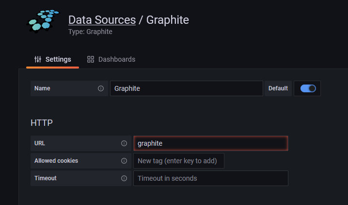

# JanusGraph Moiter with Graphite and Grafana

## Run

```shell
> docker-compose up -d
```

## Login Grafana

1. Open `http://localhost:3000`.
2. Default user and password `admin/admin`.

### Add Graphite Data Source


